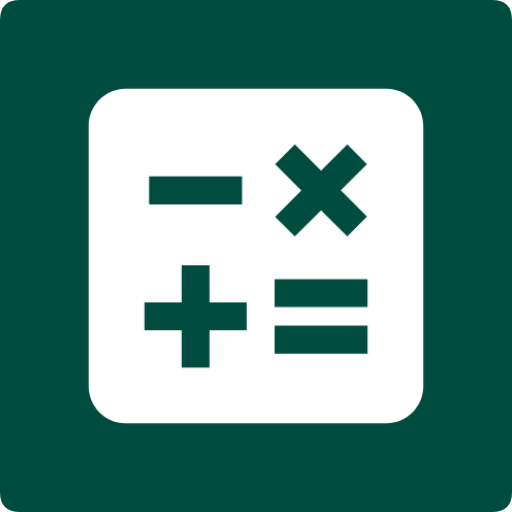
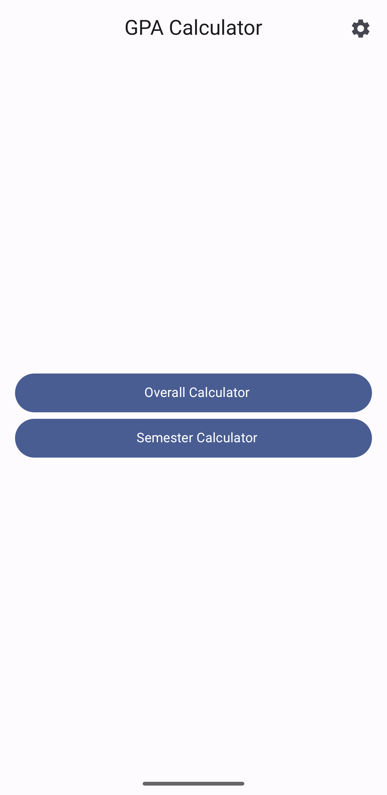
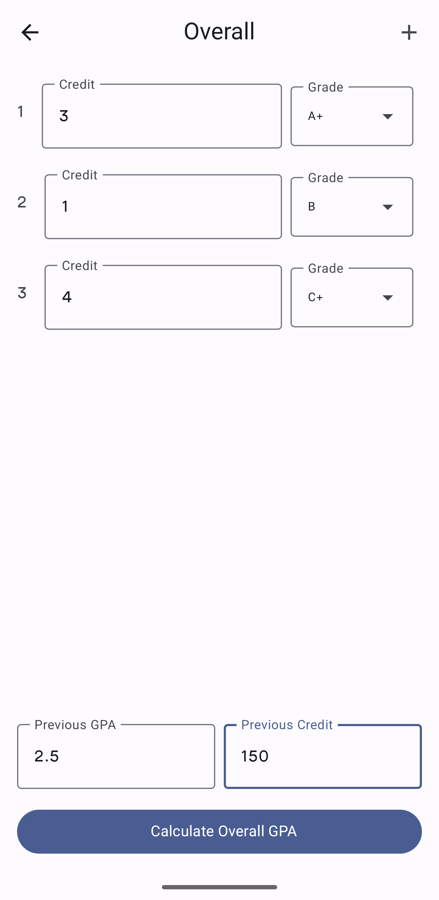
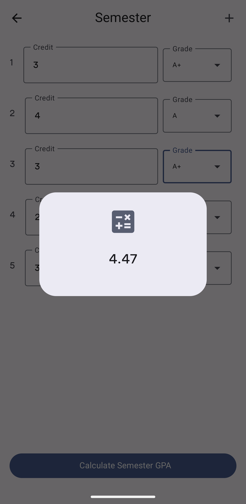

<div align="center"></div>

<h3 align="center">GPA Calculator</h3>

<p align="center">
  Calculate the average of the subjects with a precise calculation for undergraduate students
</p>

##

<h3 align="center">Application Contains</h3>

<table align="center">
    <tr><td align="center">1</td><td>Calculate the CGPA & quarterly average.</td></tr>
    <tr><td align="center">2</td><td>Choose as many subjects as you want to calculate the average.</td></tr>
    <tr><td align="center">3</td><td>English & Arabic are supported depending on the device language.</td></tr>
    <tr><td align="center">4</td><td>Ability to switch between dark and light mode.</td></tr>
</table>

<div align="center">
  <a href='https://play.google.com/store/apps/details?id=com.ss.gpacalculator'>
    
  </a>
</div>

##

<h3 align="center">Application Images</h3>

<div align="center" >
  
  
  
  
</div>

##

<h3 align="center">License</h3>

```
Copyright (C) 2021 Abdulrahman Al-Ghamdi

This program is free software: you can redistribute it and/or modify
it under the terms of the GNU General Public License as published by
the Free Software Foundation, either version 3 of the License, or
(at your option) any later version.

This program is distributed in the hope that it will be useful,
but WITHOUT ANY WARRANTY; without even the implied warranty of
MERCHANTABILITY or FITNESS FOR A PARTICULAR PURPOSE.  See the
GNU General Public License for more details.

You should have received a copy of the GNU General Public License
along with this program. If not, see https://www.gnu.org/licenses.
```
